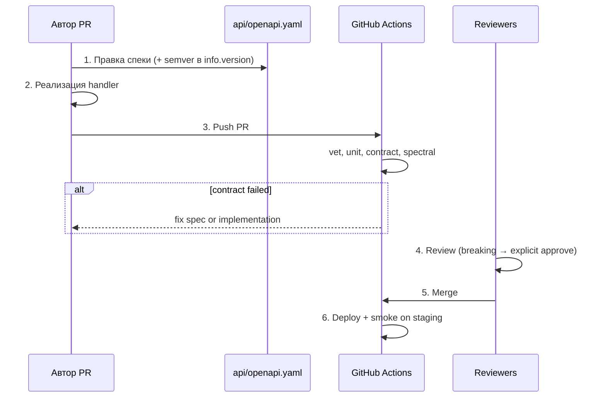

# Контрактный процесс (ctrsvc)

**Подход:** OpenAPI 3.0 (`api/openapi.yaml`) — источник истины; контрактные тесты валидируют live-ответы через **kin-openapi**.

**Почему не Pact:** один репозиторий (provider + тесты), нет отдельного consumer-кода в другом репо; OpenAPI проще для REST CRUD и даёт единую спеку для фронта/B2B.

---

## Что считается изменением контракта

| Правка | Breaking? | Комментарий |
|--------|-----------|-------------|
| Добавление нового эндпоинта | **Нет** | Расширение API |
| Добавление **обязательного** поля в request | **Да** | Старые клиенты не шлют поле |
| Добавление **опционального** поля в request | **Нет** | `additionalProperties: false` — только явные поля |
| Добавление **опционального** поля в response | **Нет** | Клиенты с `DisallowUnknownFields` должны обновиться |
| Удаление поля из response | **Да** | Падает контрактный тест |
| Переименование поля в response | **Да** | Эквивалент удаления + добавления |
| Изменение типа поля (`int` → `string`) | **Да** | JSON Schema validation fail |
| Сужение enum (убрать значение) | **Да** | |
| Расширение enum (добавить значение) | **Нет** | |
| Смена кода ошибки (`400` → `422`) | **Да** | Клиенты завязаны на код |
| Смена Content-Type ответа | **Да** | |
| Изменение `minLength` / `required` в response | **Да** | Ужесточение контракта |

---

## Кто владеет контрактом

| Роль | Ответственность |
|------|-----------------|
| **Владелец** | Команда **platform-api** (maintainers `api/openapi.yaml`) |
| **Approve** | 1 reviewer из platform-api + 1 из команды-потребителя при breaking change |
| **Потребители** | Web SPA (`travel-web`), B2B mobile SDK, `booking-service` (читает User/Order) |

Уведомления: PR с лейблом `contract-change` → Slack `#api-contracts`.

---

## Процесс изменения



1. **Автор** создаёт ветку `feature/...`, сначала обновляет `api/openapi.yaml`, затем `internal/api`.
2. Локально: `go test -race ./internal/contract/...` — зелёный.
3. PR: чеклист — «контракт обновлён», «breaking помечен в описании».
4. CI шаг **`contract`** обязателен (branch protection).
5. При **breaking**: bump `info.version` (minor/major по SemVer API), changelog, уведомить потребителей за **5 рабочих дней** до prod.
6. Merge → деплой staging → synthetic smoke → prod (canary, [hw_16](../hw_16_ranking_rollout_plan.md)).

---

## Версионирование

| Механизм | Решение |
|----------|---------|
| **Спека** | SemVer в `info.version` (`1.0.0`) |
| **URL** | Без `/v1` в учебном сервисе; в prod travel-platform — `/api/v1/...` |
| **Заголовок** | Опционально `Accept-Version: 2026-05-17` для крупных breaking (не используется в hw/17) |
| **Deprecation** | Старое поле: `deprecated: true` в OpenAPI минимум **2 релиза** (4 недели), затем удаление |

**Правило SemVer API:**  
- PATCH: bugfix, без изменения схемы  
- MINOR: новые опциональные поля/эндпоинты  
- MAJOR: breaking из таблицы выше  

---

## Что делать, если контрактный тест упал в CI

1. **Не** коммитить `t.Skip` и не отключать шаг `contract`.
2. Прочитать сообщение: `contract violation for POST /users` — обычно «required property X missing».
3. Определить намерение:
   - **Баг в коде** → исправить handler, спека верна.
   - **Намеренное изменение API** → обновить `openapi.yaml`, согласовать с потребителями, пометить breaking в PR.
4. Перезапустить job `contract` в Actions.
5. Если нужен **emergency** skip (только platform lead): JIRA + fix в течение 24 ч.

**Проверка локально:**

```bash
cd sys-design-salo/hw/17
go test -race -run '^TestContract_' ./internal/contract/...
```

**Демонстрация:** удалите поле `email` из `User` в handler — тест `TestContract_CreateUser` упадёт с `required property 'email' missing`.

---

## Quality gates (CI)

| # | Gate | Инструмент | Блокирует |
|---|------|------------|-----------|
| 1 | vet | `go vet` | PR |
| 2 | unit | `go test -race` (без contract) | PR |
| 3 | **contract** | `TestContract_*` + kin-openapi | PR |
| 4 | openapi-lint | Spectral `spectral:oas` | PR |

---

## Настройка в GitHub (один раз)

1. **Запушить** workflow: `/.github/workflows/hw17-contract.yml` в **корне** репозитория `otus-sd` (не `hw/17/.github/` — Actions его не подхватывает).
2. **Settings → Actions → General** — разрешить запуск workflows.
3. После push: вкладка **Actions** → run `hw17-contract` (шаг `contract` в логах).
4. *(Опционально)* **Settings → Branches → Branch protection** для `main`: «Require status checks» → job `test` / step `contract`.

Без branch protection CI на PR всё равно бежит, но merge не блокируется при красном CI.
