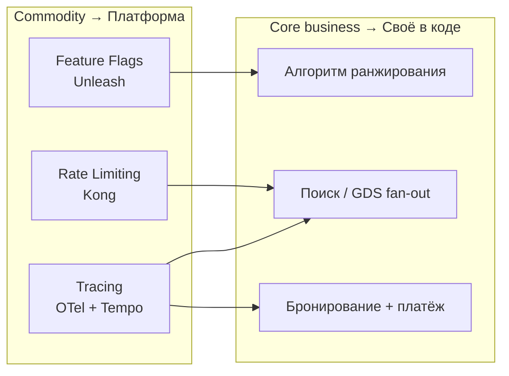

# ДЗ-13. Чек-лист «платформа vs своё»

**Версия:** 1.0  
**Кейс:** сервис поиска и бронирования авиабилетов ([hw_2.md](hw_2.md))  
**Контекст:** 5+ сервисов (API Gateway, search, booking, payment, notification), NFR **20 RPS** поиск, B2B API, ФЗ-152 (данные в РФ)

**Допущения для TCO:** стоимость инженера **$8 000/мес** (fully loaded), платформенная команда – **0.25 FTE** на поддержку интеграции после внедрения.

---

## 0. Универсальный шаблон (6 критериев)

Для каждого сценария заполняется один и тот же чек-лист из занятия 13 (§1.8, §1.17.3):

| # | Критерий | «Платформа» если… | «Своё» если… |
|---|----------|-------------------|--------------|
| 1 | Стратегическая ценность | Commodity, не конкурентное преимущество | Core business, уникальная логика |
| 2 | Зрелые решения | 5+ лет, большое комьюнити | Нет зрелых OSS/SAAS |
| 3 | Стандартность требований | Per-user/IP/key, стандартные паттерны | Уникальные правила без расширения |
| 4 | TCO за 2 года | Платформа дешевле | Своё дешевле при масштабе |
| 5 | Time to market | Нужно быстро (< 2 недель) | Есть 1–3 мес на разработку |
| 6 | Vendor lock-in | Открытый стандарт, смена backend без переписывания app | Проприетарный API, дорогая миграция |

**Итог:** подсчёт пунктов в пользу платформы; выбор: **Платформенное** / **Расширение** / **Своё**.

---

## Сценарий А. Rate Limiting

**Задача:** ограничить нагрузку на API поиска (`/api/v1/search*`) – защита от abuse, fair use B2B-партнёров, устойчивость при маркетинговом spike до **20 RPS** (проектная нагрузка, [hw_2.md](hw_2.md)).

### Чек-лист

| # | Вопрос | Ответ | Комментарий |
|---|--------|-------|-------------|
| 1 | Стратегическая ценность для бизнеса? | ☐ Да ☐ **Нет** | Лимит запросов – **commodity**; ценность – в алгоритме поиска и GDS-интеграциях |
| 2 | Зрелые решения? | ☐ **Да** ☐ Нет | **Kong**, **nginx**, **Envoy**, **Traefik** – 10+ лет, rate limiting из коробки |
| 3 | Стандартны ли требования? | ☐ **Да** ☐ Нет | Per-**API-key** (B2B), per-IP, global RPS; **не** тарифный план в gateway (бизнес-логика – в сервисе) |
| 4 | TCO за 2 года | ☐ **Платформа** ☐ Своё | См. расчёт ниже |
| 5 | Time to market | ☐ **Платформа** ☐ Своё | Kong plugin – **2–3 дня** vs middleware с нуля – **6–8 недель** |
| 6 | Vendor lock-in | ☐ **Низкий** ☐ Высокий | Декларативный конфиг (deck/Kong YAML); миграция на Envoy – **~3–5 дней** |

**Нестандартные требования (если появятся):** лимит «по тарифу авиакомпании в БД» – **не в gateway**, а в search-service; gateway только transport-level limits.

### TCO за 2 года

| Статья | Платформа (Kong OSS + Redis) | Своё (Go middleware в каждом сервисе) |
|--------|------------------------------|-------------------------------------|
| Лицензия | $0 (OSS) | $0 |
| Infra (2 реплики gateway + Redis) | $150/мес × 24 = **$3 600** | $0 (в pod search-api) |
| Внедрение (интеграция, тесты) | 5 чел-дней × $400 = **$2 000** | 1.5 инж × 1.5 мес = **$18 000** |
| Поддержка (0.25 FTE platform) | $2 000/мес × 24 = **$48 000** | $1 500/мес × 24 = **$36 000** (3 команды дублируют) |
| **Итого 2 года** | **≈ $53 600** | **≈ $54 000** + риск рассинхрона лимитов между сервисами |

При **3+ командах** своё решение дороже из-за дублирования; при одной команде – паритет, но платформа выигрывает по **time to market** и единообразию.

### Time to market

| Вариант | Срок |
|---------|------|
| Платформа | **2–3 дня** (Kong `rate-limiting` + `key-auth` для B2B) |
| Своё | **6–8 недель** (библиотека, Redis, тесты, observability, rollout во все сервисы) |

### Vendor lock-in и митигация

| Риск | Оценка | Митигация |
|------|--------|-----------|
| Kong-специфичные плагины | Средний | Хранить routes/limits в **git** (deck); абстрагировать лимиты в OpenAPI + внешний config |
| Redis как SPOF | Низкий | Managed Redis, реплика; fallback local rate limit (degraded) |

### ИТОГ: **5 из 6** → платформа

**Выбор:** **Платформенное** – **Kong API Gateway** (north-south) + Redis для distributed counters.

**Обоснование:** Rate limiting – типовая задача edge-слоя ([зан. 13, §1.8.3](https://)). Kong закрывает per-key/global limits за дни, без дублирования в search/booking. Своё оправдано только при **> 50** нестандартных правил в gateway; у нас правила стандартные, а тарифы – в доменном сервисе.

**Отвергнутые альтернативы:**

| Альтернатива | Почему нет |
|--------------|------------|
| In-app middleware (Go `golang.org/x/time/rate`) | Дублирование в 5 сервисах, нет единой точки для B2B-ключей |
| Только nginx без API management | Слабее API-key, audit, плагины для auth |
| Самописный gateway на Go | TCO и сроки как в ADR-013 конспекта: 2 мес vs 1 день |

---

## Сценарий Б. Feature Flags

**Задача:** постепенный rollout **нового алгоритма ранжирования** в search-service (canary 5% → 25% → 100%), kill switch при деградации latency/SLO.

### Чек-лист

| # | Вопрос | Ответ | Комментарий |
|---|--------|-------|-------------|
| 1 | Стратегическая ценность? | ☐ Да (алгоритм) ☐ **Нет (система флагов)** | **Алгоритм** – core; **инфраструктура флагов** – commodity |
| 2 | Зрелые решения? | ☐ **Да** ☐ Нет | **Unleash**, **LaunchDarkly**, **Flagsmith**, **GO Feature Flag** |
| 3 | Стандартны ли требования? | ☐ **Да** ☐ Нет | % rollout, targeting по `partner_id`, kill switch, audit |
| 4 | TCO за 2 года | ☐ **Платформа** ☐ Своё | См. ниже |
| 5 | Time to market | ☐ **Платформа** ☐ Своё | Unleash + Go SDK – **3–5 дней** vs своё – **4–6 недель** |
| 6 | Vendor lock-in | ☐ **Низкий** (Unleash) ☐ Высокий (LD SaaS) | Self-hosted Unleash; данные в РФ (ФЗ-152) |

**Нестандартные требования:** A/B по маршруту `MOW-LED`, по `partner_id` – поддерживается Unleash strategies без своей БД флагов.

### TCO за 2 года

| Статья | Платформа (Unleash self-hosted) | Своё (PostgreSQL + admin UI + SDK) |
|--------|-----------------------------------|-------------------------------------|
| Лицензия | $0 (OSS) | $0 |
| Infra (Unleash + Postgres) | $80/мес × 24 = **$1 920** | Включено в общий Postgres |
| Внедрение | 4 чел-дня = **$1 600** | 2 инж × 1 мес = **$16 000** |
| Поддержка | $500/мес × 24 = **$12 000** | $800/мес × 24 = **$19 200** |
| **Итого** | **≈ $15 520** | **≈ $35 200** |

LaunchDarkly SaaS (~$500/мес × 24 = **$12 000** только лицензия) + риск хранения контекста вне РФ → для кейса **отклонён** в пользу Unleash on-prem.

### Time to market

| Вариант | Срок |
|---------|------|
| Платформа (Unleash) | **3–5 дней** |
| Своё | **4–6 недель** + нет готового audit/targeting |
| Env variables only | **1 день**, но **без** % rollout и targeting → не подходит для canary ранжирования |

### Vendor lock-in и митигация

| Риск | Оценка | Митигация |
|------|--------|-----------|
| Unleash API | Низкий | OSS, можно форк; экспорт флагов в git (Unleash + GitOps) |
| LaunchDarkly SaaS | Высокий | Не использовать: проприетарный API, данные за рубежом |
| Зависимость SDK в коде | Низкий | Обёртка `FeatureToggle` interface в search-service |

### ИТОГ: **6 из 6** → платформа

**Выбор:** **Платформенное** – **Unleash** (self-hosted в K8s, namespace `platform`).

**Обоснование:** Для canary ранжирования нужны targeting, audit и kill switch – это не «env var на деплой». Unleash даёт это за дни, TCO **~2.3×** ниже своей реализации. Своё имеет смысл при **< 5** статичных флагов без процентного rollout – у нас rollout обязателен по SLO ([hw_11_slo.md](hw_11_slo.md)).

**Отвергнутые альтернативы:**

| Альтернатива | Почему нет |
|--------------|------------|
| Только `DEPLOY_NEW_RANKING=true` | Нет gradual rollout, высокий blast radius |
| LaunchDarkly cloud | ФЗ-152, vendor lock-in, лицензия |
| ConfigMap в K8s | Нет targeting, задержка propagation, нет audit UI |

---

## Сценарий В. Distributed Tracing

**Задача:** сквозная трассировка запроса: **Gateway → Search → Booking → Payment → Notification** (5 hop), корреляция с логами и SLO-алертами ([hw/10](hw/10/), [hw_12_alerts_runbooks.md](hw_12_alerts_runbooks.md)).

### Чек-лист

| # | Вопрос | Ответ | Комментарий |
|---|--------|-------|-------------|
| 1 | Стратегическая ценность? | ☐ Да ☐ **Нет** | Tracing – **commodity observability**; уже частично в ДЗ-10 |
| 2 | Зрелые решения? | ☐ **Да** ☐ Нет | **OpenTelemetry** (CNCF graduated), Jaeger, Tempo, Zipkin |
| 3 | Стандартны ли требования? | ☐ **Да** ☐ Нет | W3C `traceparent`, OTLP export, Grafana UI |
| 4 | TCO за 2 года | ☐ **Платформа** ☐ Своё | См. ниже |
| 5 | Time to market | ☐ **Платформа** ☐ Своё | OTel SDK уже в hw/10; backend – **2–3 дня** |
| 6 | Vendor lock-in | ☐ **Низкий** ☐ Высокий | OTel – стандарт; backend сменяем без смены кода |

### TCO за 2 года

| Статья | Платформа (OTel + Grafana Tempo) | Своё (custom trace ID + storage) |
|--------|----------------------------------|----------------------------------|
| Лицензия | $0 | $0 |
| Infra (Tempo + S3/GCS) | $50/мес × 24 = **$1 200** | $200/мес × 24 = **$4 800** (неоптимальное хранение) |
| Внедрение | 3 дня (донастройка hw/10) = **$960** | 2 инж × 2 мес = **$32 000** |
| Поддержка | $400/мес × 24 = **$9 600** | $600/мес × 24 = **$14 400** |
| **Итого** | **≈ $11 760** | **≈ $51 200** |

**Соотношение TCO:** платформа **~4.4×** дешевле (близко к примеру конспекта ×43 при более агрессивной оценке «своего»).

### Time to market

| Вариант | Срок |
|---------|------|
| Платформа | **2–3 дня** (Tempo + Grafana datasource; hw/10 уже шлёт OTLP) |
| Своё | **3–4 месяца** (propagation, sampling, storage, UI) |

### Vendor lock-in и митигация

| Риск | Оценка | Митигация |
|------|--------|-----------|
| Jaeger vs Tempo vs Honeycomb | **Низкий** | Только OTLP exporter в коде; backend – конфиг |
| Sampling policy | Средний | Head-based 10% в prod, 100% при error (tail sampling в Tempo) |
| Хранение PII в spans | Средний | Не логировать ФИО/паспорт в attributes; scrub в collector |

### ИТОГ: **6 из 6** → платформа

**Выбор:** **Платформенное** – **OpenTelemetry SDK** (уже в [hw/10](hw/10/)) + **Grafana Tempo** + Grafana для trace↔logs↔metrics.

**Обоснование:** Distributed tracing – открытый стандарт с зрелой экосистемой. Своё не решает sampling, tail-based retention и корреляцию за разумный TCO. Инвестиция ДЗ-10 (OTel) – правильная; остаётся платформенный backend, а не самописное хранилище spans.

**Отвергнутые альтернативы:**

| Альтернатива | Почему нет |
|--------------|------------|
| Только `X-Request-ID` в логах | Нет дерева spans, слабая диагностика fan-out к GDS |
| Jaeger all-in-one без OTel | Дублирование instrumentation при смене backend |
| Datadog APM only | Vendor lock-in, стоимость при росте span volume |

---

## Сводная таблица решений

| Сценарий | Итог чек-листа | Выбор | Инструмент | Ключевой trade-off |
|----------|----------------|-------|------------|-------------------|
| **А Rate limiting** | 5/6 | Платформа | Kong + Redis | Единая точка для B2B; не тащить лимиты в 5 кодовых баз |
| **Б Feature flags** | 6/6 | Платформа | Unleash (self-hosted) | Canary ранжирования vs blast radius env vars |
| **В Distributed tracing** | 6/6 | Платформа | OTel + Tempo | Стандарт W3C; hw/10 уже даёт SDK |

---

## Связь с курсом

| Занятие | Связь |
|---------|-------|
| **4** (TCO) | Оценка стоимости за 2 года, FTE поддержки |
| **10** (Observability) | OTel SDK, метрики – база для tracing |
| **11–12** (SLO, алерты) | Feature flags для безопасного rollout без burn budget |
| **13** (Платформа) | API Gateway = rate limit; mesh/gateway ≠ бизнес-логика |

---

## Вывод

Для учебного сервиса поиска и бронирования по всем **трём сценариям** доминирует **платформенный подход**: commodity-задачи выносятся на Kong, Unleash и OpenTelemetry/Tempo. **Своё** остаётся для **алгоритма ранжирования**, интеграций GDS и доменной логики бронирования – не для инфраструктурных cross-cutting concerns.
