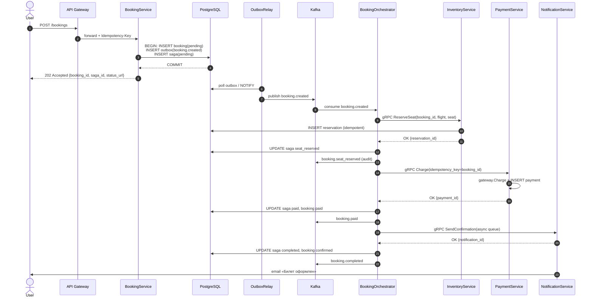
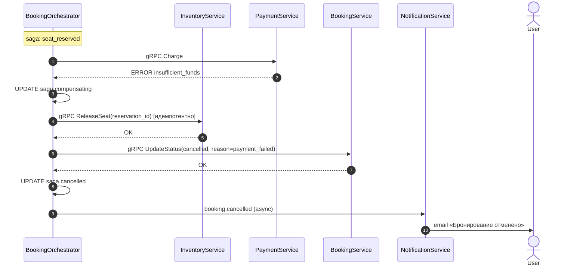
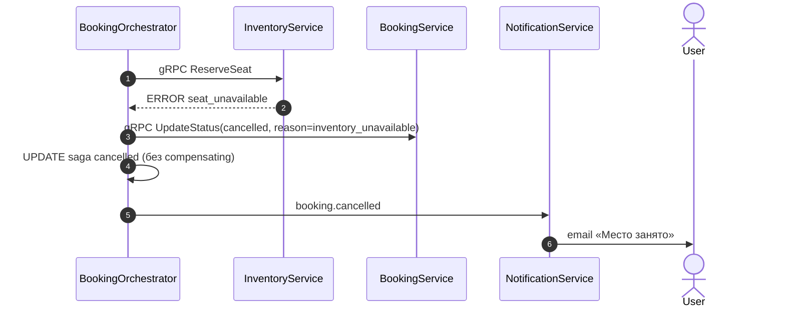
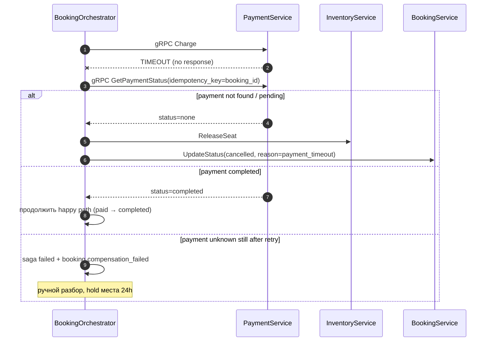

# ДЗ-14. Async-взаимодействие: оформление заказа с оплатой

**Версия:** 1.0  
**Кейс:** бронирование авиабилета с оплатой ([hw_2.md](hw_2.md))  
**Связь:** репликация [hw_8_replication-adr.md](hw_8_replication-adr.md), SLO бронирования 99.95% [hw_11_slo.md](hw_11_slo.md)

---

## 1. Контекст и выбор паттерна

### 1.1. Проблема синхронной цепочки

Синхронный путь `POST /bookings` → ReserveSeat → Charge → SendEmail держит HTTP-соединение **3–8 с** (платёжный шлюз до 5 с, [hw_2.md](hw_2.md)). Availability цепочки из 4 hop: **0.999⁴ ≈ 0.996** – ниже SLO бронирования **99.95%**.

### 1.2. Решение

| Элемент | Выбор | Обоснование |
|---------|-------|-------------|
| Паттерн координации | **Orchestration Saga** | 4 участника, ветвления, компенсации, таймауты – состояние в одном месте |
| Публикация событий | **Transactional Outbox** | Атомарно с `INSERT booking`; нет dual write |
| Брокер | **Kafka** | Ordering по `booking_id`, replay, audit trail событий |
| Команды между шагами | **Sync gRPC** (orchestrator → сервисы) | Команды не в Kafka (antipattern request-reply, зан. 14) |
| Ответ пользователю | **202 Accepted** + polling/WebSocket | Latency ответа **~50 ms** vs 3–8 s |

**Choreography отвергнута:** при 4 сервисах и компенсациях сложно отследить состояние; отладка «кто кого слушает» дороже одного orchestrator + таблица `booking_sagas`.

**2PC/XA отвергнуты:** не поддерживаются платёжным шлюзом и GDS; блокировки на минуты недопустимы.

---

## 2. Участники

| Сервис | Ответственность |
|--------|-----------------|
| **BookingService** | Приём заказа, CRUD бронирования, outbox, статус для клиента |
| **BookingOrchestrator** | Машина состояний саги, компенсации, таймауты |
| **InventoryService** | Резерв/освобождение места на рейсе |
| **PaymentService** | Списание через шлюз, refund (компенсация) |
| **NotificationService** | Email/SMS подтверждение (best-effort) |
| **OutboxRelay** | CDC/polling outbox → Kafka |

**Топик Kafka:** `travel.booking.events` (ключ партиции: `booking_id`).

---

## 3. Машина состояний саги

```text
pending → seat_reserved → paid → completed
              ↓              ↓
         compensating ←───────┘
              ↓
          cancelled | failed
```

| Состояние | Описание | Таймаут |
|-----------|----------|---------|
| `pending` | Бронь создана, сага стартовала | – |
| `seat_reserved` | Место зарезервировано | 15 мин до оплаты |
| `paid` | Платёж успешен | – |
| `completed` | Уведомление отправлено (или пропущено) | terminal |
| `compensating` | Выполняются откаты | 5 мин |
| `cancelled` | Компенсация успешна | terminal |
| `failed` | Компенсация не завершена – ручной разбор | terminal |

Состояние хранится в **PostgreSQL** (`booking_sagas`), не in-memory – переживает rolling update ([зан. 14, best practice 3]).

---

## 4. События и схемы

Все события – **CloudEvents 1.0** envelope + payload. Обязательные поля: `event_id` (UUID v4), `saga_id`, `booking_id`, `occurred_at` (ISO-8601).

### 4.1. `booking.created` (команда старта саги)

Публикуется из outbox BookingService.

```json
{
  "specversion": "1.0",
  "type": "travel.booking.created.v1",
  "source": "/booking-service",
  "id": "550e8400-e29b-41d4-a716-446655440000",
  "time": "2026-05-17T12:00:00Z",
  "datacontenttype": "application/json",
  "data": {
    "saga_id": "s-77",
    "booking_id": "b-99",
    "user_id": "u-42",
    "flight_id": "SU-1234",
    "seat": "12A",
    "amount_kopecks": 1500000,
    "currency": "RUB",
    "idempotency_key": "client-req-abc-123"
  }
}
```

| Поле | Тип | Описание |
|------|-----|----------|
| `saga_id` | string | ID саги |
| `booking_id` | string | ID бронирования |
| `user_id` | string | Пользователь |
| `flight_id` | string | Рейс |
| `seat` | string | Место |
| `amount_kopecks` | int64 | Сумма к оплате |
| `idempotency_key` | string | Ключ клиента (дедуп POST) |

### 4.2. `booking.seat_reserved`

```json
{
  "type": "travel.booking.seat_reserved.v1",
  "data": {
    "saga_id": "s-77",
    "booking_id": "b-99",
    "reservation_id": "r-55",
    "flight_id": "SU-1234",
    "seat": "12A",
    "expires_at": "2026-05-17T12:15:00Z"
  }
}
```

### 4.3. `booking.paid`

```json
{
  "type": "travel.booking.paid.v1",
  "data": {
    "saga_id": "s-77",
    "booking_id": "b-99",
    "payment_id": "p-22",
    "gateway_transaction_id": "gw-tx-881",
    "amount_kopecks": 1500000
  }
}
```

### 4.4. `booking.completed`

```json
{
  "type": "travel.booking.completed.v1",
  "data": {
    "saga_id": "s-77",
    "booking_id": "b-99",
    "reservation_id": "r-55",
    "payment_id": "p-22",
    "notification_id": "n-11"
  }
}
```

### 4.5. `booking.cancelled` (после компенсации)

```json
{
  "type": "travel.booking.cancelled.v1",
  "data": {
    "saga_id": "s-77",
    "booking_id": "b-99",
    "reason": "payment_failed",
    "compensation_steps": ["release_seat", "cancel_booking"],
    "refund_id": null
  }
}
```

### 4.6. `booking.compensation_failed` (эскалация)

```json
{
  "type": "travel.booking.compensation_failed.v1",
  "data": {
    "saga_id": "s-77",
    "booking_id": "b-99",
    "failed_step": "refund",
    "error": "gateway_timeout",
    "requires_manual_intervention": true
  }
}
```

**Версионирование:** суффикс `.v1` в `type`; новые поля – только additive (backward compatible).

---

## 5. Happy path

### 5.1. Sequence diagram



### 5.2. Пошаговое описание

| # | Шаг | Детали |
|---|-----|--------|
| 1 | `POST /bookings` | Payload: `{flight_id, user_id, seat, payment_method_id}` + header `Idempotency-Key` |
| 2 | Транзакция BookingService | `bookings.status=pending`, `outbox`, `booking_sagas.state=pending` – **одна TX** |
| 3 | **202 Accepted** | Клиент опрашивает `GET /bookings/{id}` или WebSocket |
| 4 | OutboxRelay | Публикует `booking.created` (at-least-once) |
| 5 | ReserveSeat | gRPC, timeout **3 s**, идемпотентность по `booking_id` |
| 6 | Charge | `idempotency_key = booking_id`, timeout **10 s** |
| 7 | SendConfirmation | Best-effort; сбой **не** откатывает оплату |
| 8 | Terminal | `booking.status=confirmed`, saga `completed` |

**Идемпотентность:** повтор `booking.created` → orchestrator проверяет `saga.state` и не дублирует шаги.

---

## 6. Сценарии ошибок и компенсации

### 6.1. Ошибка 1: оплата отклонена (`insufficient_funds`)

**Момент сбоя:** после успешного `ReserveSeat`, `Charge` вернул `FAILED_INSUFFICIENT_FUNDS`.



| Компенсация | Порядок | Идемпотентность |
|-------------|---------|----------------|
| `ReleaseSeat` | 1 | `DELETE` / mark released; повтор → OK |
| `UpdateStatus(cancelled)` | 2 | UPSERT status; повтор → OK |
| Refund | – | Не нужен (деньги не списаны) |

---

### 6.2. Ошибка 2: место недоступно (`seat_unavailable`)

**Момент сбоя:** `ReserveSeat` вернул `SEAT_ALREADY_TAKEN` – до оплаты.



| Компенсация | Порядок | Примечание |
|-------------|---------|------------|
| ReleaseSeat | **Нет** | Резерва не было |
| Cancel booking | 1 | Единственный шаг |

**Trade-off:** пользователь узнаёт об отказе через **1–3 с** (async), не мгновенно – приемлемо при 202 + push на `status_url`.

---

### 6.3. Ошибка 3: таймаут платёжного шлюза (`payment_timeout`)

**Момент сбоя:** `Charge` не ответил за 10 s – **неизвестно**, списаны ли деньги (критичный сценарий для финансов).



| Шаг | Действие |
|-----|----------|
| 1 | **Не** компенсировать вслепую – сначала `GetPaymentStatus` |
| 2a | Нет платежа → `ReleaseSeat` + `cancelled` |
| 2b | Платёж прошёл → завершить сагу (избежать двойного refund) |
| 3 | Ambiguous > 30 мин → `saga.failed`, алерт on-call, метрика `saga_stuck_total` |

**Компенсация при подтверждённом списании после отмены:** `Refund(payment_id)` – идемпотентный (`ON CONFLICT` / «already refunded» → OK).

---

## 7. Outbox pattern (явно)

```sql
-- В одной транзакции с созданием брони
BEGIN;
  INSERT INTO bookings (id, user_id, flight_id, seat, status, idempotency_key)
  VALUES ('b-99', 'u-42', 'SU-1234', '12A', 'pending', 'client-req-abc-123');

  INSERT INTO booking_sagas (saga_id, booking_id, state, deadline)
  VALUES ('s-77', 'b-99', 'pending', NOW() + INTERVAL '30 minutes');

  INSERT INTO outbox (id, aggregate_type, aggregate_id, event_type, payload, created_at)
  VALUES (
    gen_random_uuid(),
    'booking', 'b-99',
    'travel.booking.created.v1',
    '{"saga_id":"s-77", ...}'::jsonb,
    NOW()
  );
COMMIT;
```

| Компонент | Роль |
|-----------|------|
| `outbox` table | Гарантия «бронь и событие» атомарно |
| OutboxRelay | Debezium CDC или polling 100 ms → Kafka |
| Orchestrator consumer | `event_id` dedup (Redis SET NX, TTL 24h) |

**Без outbox:** риск «бронь есть, сага не стартовала» – нарушение RPO=0 для бизнес-состояния ([hw_8](hw_8_replication-adr.md)).

---

## 8. Идемпотентность (сводка)

| Операция | Ключ | Механизм |
|----------|------|----------|
| POST /bookings | `Idempotency-Key` (клиент) | UNIQUE в `bookings` |
| ReserveSeat | `booking_id` | `ON CONFLICT DO NOTHING` |
| Charge | `booking_id` | `payments.idempotency_key` UNIQUE |
| ReleaseSeat | `reservation_id` | Повтор → 200 OK |
| Refund | `payment_id` | Gateway idempotent refund API |
| Consumer events | `event_id` | Redis NX / processed_events table |

---

## 9. Наблюдаемость и SLA

| Метрика | Назначение |
|---------|------------|
| `saga_duration_seconds` | Histogram по terminal state |
| `saga_stuck_total` | Сага не terminal > 10 min → alert |
| `outbox_lag_seconds` | Задержка relay |
| Trace | `saga_id` в OTel baggage ([hw/10](hw/10/)) |

**Eventual consistency:** статус `confirmed` у пользователя через **1–3 с** после 202 – документировать в API (`status: processing`).

---

## 10. Сравнение с синхронным вариантом

| Критерий | Sync chain | Async saga + outbox |
|----------|------------|---------------------|
| Latency для пользователя | 3–8 s | ~50 ms (202) |
| Availability (оценка) | ~99.6% | ~99.8%+ (decoupling) |
| Консистентность | Strong в ответе | Eventual статус |
| Сложность | Ниже | Outbox + orchestrator + recovery |
| Double booking риск | Транзакция в одном сервисе | ReserveSeat + saga state |

---

## 11. Итог

Спроектирован **Orchestration Saga** с **Transactional Outbox** для сценария «бронирование + оплата»:

- **Happy path:** 202 → outbox → Kafka → reserve → pay → notify → completed  
- **3 ошибки:** insufficient_funds, seat_unavailable, payment_timeout – с компенсациями и идемпотентностью  
- **6 типов событий** со схемами CloudEvents  
- Команды – gRPC; события – Kafka; состояние саги – PostgreSQL
