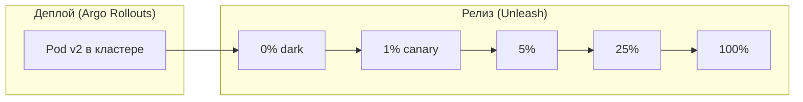
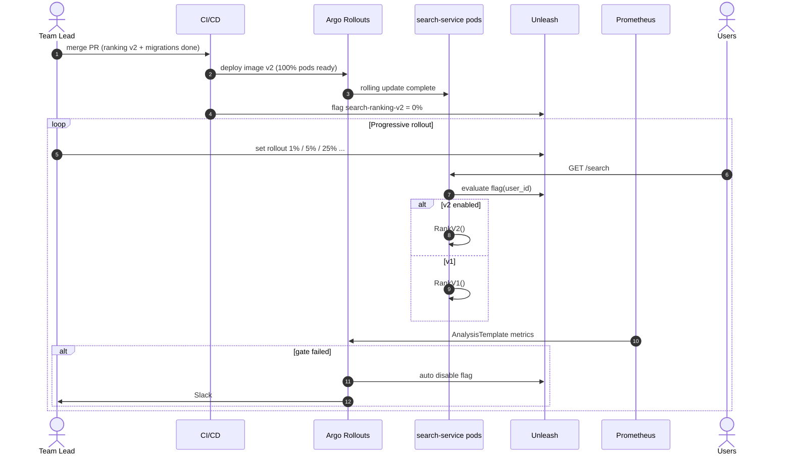

# ДЗ-16. План выката: новый алгоритм ранжирования поиска

**Версия:** 1.0  
**Сервис:** `search-service` (метапоиск авиабилетов)  
**Изменение:** алгоритм ранжирования v2 + индекс БД + колонка `relevance_score`  
**Связь:** SLO [hw_11_slo.md](hw_11_slo.md), feature flags [hw_13_platform_checklist.md](hw_13_platform_checklist.md), кэш [hw/15](hw/15/), алерты [hw_12_alerts_runbooks.md](hw_12_alerts_runbooks.md)

---

## 0. Контекст изменения

| Компонент | Что меняется | Риск |
|-----------|--------------|------|
| **Ранжирование** | Новая формула score (цена, время, перевозчик, партнёрские веса) | Падение конверсии «поиск → бронь» |
| **SQL** | Индекс `idx_search_results_relevance`, колонка `relevance_score` | Регрессия latency, блокировки при миграции |
| **API** | Без изменений контракта (`GET /api/v1/search`) | Низкий |

**Параметры продакшена (целевой масштаб):**

| Параметр | Значение |
|----------|----------|
| Реплики | **6** (HPA min 4, max 10) |
| Пиковый RPS | **20 RPS** (проект [hw_2](hw_2.md)); нагрузочный тест – до 100 RPS |
| SLO поиска | Availability **99.9%**, latency **99% < 1.5 s**, error rate **< 0.1%** sustained |
| Deployment frequency | ~2 релиза / неделю |
| Платформа | Kubernetes + **Argo Rollouts** + **Unleash** |

---

## 1. Стратегия деплоя

**Выбрано: Canary (progressive delivery) + Feature flag (decouple deploy from release).**

| Стратегия | Вердикт | Причина |
|-----------|---------|---------|
| **Canary** | **Выбрана** | Алгоритм влияет на **бизнес-метрики**; нужен контролируемый blast radius и gates |
| Blue-green | Отвергнута | 2× ресурсы на переключение; нет постепенного A/B на реальном трафике |
| Rolling update (без анализа) | Отвергнута | Статус-кво: при регрессии ранжирования страдает **100%** трафика сразу |

**Дополнительно (до canary):**

- **Shadow traffic** (24 ч в staging/prod mirror): v2 считает score, ответ клиенту – v1; сравнение распределений offline.
- **Dark launch**: бинарь v2 в prod, флаг **0%** – код на месте, трафик на старом алгоритме.

**Обратная совместимость API:** **да** – меняется только порядок элементов в JSON, схема полей та же.



---

## 2. Миграция БД (Expand–Migrate–Contract)

Выполняется **за 3 дня до** основного rollout трафика на v2.

### Фаза Expand (деплой D-3)

```sql
-- Совместимо с v1: колонка nullable, v1 не читает
ALTER TABLE search_results
  ADD COLUMN IF NOT EXISTS relevance_score DOUBLE PRECISION NULL;

CREATE INDEX CONCURRENTLY IF NOT EXISTS idx_search_results_relevance
  ON search_results (relevance_score DESC NULLS LAST);
```

| Вопрос | Ответ |
|--------|-------|
| Совместима с v1? | **Да** – v1 игнорирует колонку |
| Downtime | **Нет** (`CONCURRENTLY`) |

### Фаза Migrate (фон, D-2 … D-1)

```sql
-- Батчами по 10k строк
UPDATE search_results
SET relevance_score = compute_legacy_relevance(id)
WHERE relevance_score IS NULL
  AND id IN (SELECT id FROM search_results WHERE relevance_score IS NULL LIMIT 10000);
```

**Оценка:** ~500k строк → **~1 ч** при батче 10k, off-peak.

### Фаза Contract

**Не требуется** на первом релизе (только добавление). Удаление колонки – отдельный техдолг через 90 дней, если v1 снят.

**Rollback БД:**

| Момент | Действие |
|--------|----------|
| До бэкфила | `DROP INDEX CONCURRENTLY` + `DROP COLUMN relevance_score` |
| После бэкфила | Колонку **оставляем** (nullable); откат только через feature flag |

---

## 3. Progressive rollout (этапы и проценты)

Управление трафиком: **Unleash** `search-ranking-v2` (gradual rollout + stickiness по `user_id`).  
Параллельно Argo Rollouts держит **100% pod’ов на образе v2** после успешного canary инфраструктуры (или 1 pod canary на этапе 0 – опционально).

| Этап | % трафика на v2 | Длительность | Тип gate | Кто promote |
|------|-----------------|--------------|----------|-------------|
| **0. Dark launch** | **0%** | 30 мин | Smoke, нет 5xx на `/healthz` | Auto |
| **1. Canary** | **1%** | 15 мин | Технические SLO | Auto (Argo Analysis) |
| **2. Early adopter** | **5%** | 30 мин | Тех. + бизнес (мягкий) | Auto |
| **3. Quarter** | **25%** | 60 мин | Тех. + бизнес (строгий) | **Manual** (team lead) |
| **4. Majority** | **50%** | 60 мин | Те же | Manual (опционально) |
| **5. Full** | **100%** | 24 ч наблюдение | Burn rate SLO | Auto после approve |

**Shadow (опционально, D-1):** 100% запросов дублируются на v2 async, ответ не отдаётся клиенту; сравнение p95 вычисления score.

---

## 4. Feature flag

| Параметр | Значение |
|----------|----------|
| **Имя** | `search-ranking-v2` |
| **Тип** | **release** (+ **ops** killswitch после 100%) |
| **Провайдер** | Unleash (self-hosted, [hw_13](hw_13_platform_checklist.md)) |
| **Stickiness** | `user_id` – один пользователь не «прыгает» между v1/v2 в сессии |
| **Начальный %** | 0% (dark launch) |
| **Killswitch** | **Да** – `enabled=false` → мгновенно 100% v1 **без redeploy** (< 30 с propagation) |
| **TTL флага** | Удалить или перевести в ops-only через **30 дней** после 100% |

**Targeting (этап 3+):** можно ограничить `partner_id IN (internal_qa, beta_b2b)` перед глобальным 25%.

---

## 5. Метрики и gates по этапам

### 5.1. Технические (каждый этап, окно 5 min, 3 подряд failing → rollback)

| Метрика | PromQL / источник | Gate (этапы 1–2) | Gate (этапы 3–5) | Rollback |
|---------|-------------------|------------------|------------------|----------|
| **Error rate (5xx)** | `sum(rate(http_requests_total{route=~"/api/v1/search.*",status=~"5.."}[5m])) / sum(rate(...))` | **< 0.5%** | **< 0.1%** | > порога 3×5 min |
| **p99 latency** | `histogram_quantile(0.99, ...)` | **< 2.0 s** ([hw_12](hw_12_alerts_runbooks.md)) | **< 1.8 s** | > 2.0 s |
| **p95 latency** | то же, 0.95 | **< 1.5 s** (NFR) | **< 1.5 s** | > 1.65 s (110% NFR) |
| **Cache hit rate** | custom `search_cache_hit_ratio` | **> 60%** | **> 70%** | < 50% (риск stampede после deploy) |
| **Upstream fan-out errors** | CB open rate | **< 1%** requests | **< 0.5%** | > 2% |

### 5.2. Бизнес-метрики (этапы 2+, минимум 30 min данных)

| Метрика | Определение | Gate | Rollback |
|---------|-------------|------|----------|
| **CTR поиск → карточка рейса** | клики / поиски | ≥ baseline × **0.98** | < baseline × **0.95** |
| **Conversion поиск → бронь** | `POST /bookings` / searches (lag 1h) | ≥ baseline × **0.98** (этап 2), **1.00** (этап 3+) | < baseline × **0.95** |
| **Средняя позиция клика** | analytics | не хуже +2 позиции vs baseline | +5 позиций |
| **Null-result rate** | пустые выдачи / все поиски | ≤ baseline + **0.5 pp** | > baseline + **2 pp** |

**Baseline:** медиана за **7 дней** в то же время суток (seasonality).

### 5.3. Матрица «этап → обязательные метрики»

| Этап | Error / Latency | Cache | CTR | Conversion |
|------|-----------------|-------|-----|------------|
| 0 (0%) | ✓ | ✓ | – | – |
| 1 (1%) | ✓ | ✓ | – | – |
| 2 (5%) | ✓ | ✓ | ✓ | ✓ (мягкий) |
| 3 (25%) | ✓ | ✓ | ✓ | ✓ (строгий) |
| 4–5 | ✓ | ✓ | ✓ | ✓ |

---

## 6. Критерии отката (rollback)

### 6.1. Автоматический rollback

Срабатывает **Argo Rollouts Analysis** + Alertmanager webhook → `rollout abort`:

| Условие | Действие |
|---------|----------|
| 5xx rate > **0.5%** (этапы 1–2) или > **0.1%** (этапы 3+) **3 окна по 5 min** | Abort rollout + Unleash **0%** |
| p99 > **2.0 s** 3×5 min | То же |
| `SearchHighErrorRate` / `SearchLatencyP99High` firing **critical** | То же + page on-call |
| Conversion < baseline × **0.95** (этап ≥ 2, 45 min данных) | Unleash 0% (флаг); rollout abort при необходимости |

**Команды:**

```bash
# 1. Мгновенно выключить алгоритм v2 (< 30 с)
curl -X PATCH "$UNLEASH_API/admin/projects/default/features/search-ranking-v2" \
  -d '{"enabled": false}'

# 2. Остановить progressive rollout
kubectl argo rollouts abort search-service -n production

# 3. Откат образа (если баг в бинаре, не в флаге)
kubectl argo rollouts undo search-service -n production
```

**Время отката:** **< 3 мин** (killswitch) + **< 10 мин** (полный undo образа).

### 6.2. Ручной rollback

| Триггер | Кто решает |
|---------|------------|
| Жалобы B2B-партнёров на «странную выдачу» | Product + on-call |
| Падение conversion без технических алертов | Team lead |
| Инцидент P1 в смежном сервисе | Eng manager |

### 6.3. Пост-rollback

- Сброс кэша поиска: `POST /admin/cache/invalidate?prefix=search:` ([hw/15](hw/15/))
- Держать флаг v2 **off** минимум 24 ч; RCA в течение 48 ч
- Не повторять rollout до исправления + прохождения staging canary 24 ч

---

## 7. Sequence: выкат с feature flag



---

## 8. Pre-deploy / Post-deploy checklist

### Pre-deploy (T-24h … T-0)

| # | Пункт | Ответственный |
|---|-------|--------------|
| 1 | Миграция Expand применена в prod, индекс `VALID` | DBA |
| 2 | Staging: canary 24 h, gates green | QA |
| 3 | Shadow traffic: расхождение p95 score v1/v2 < 20% | Search team |
| 4 | `scripts/warm-cache.sh` – топ-100 запросов ([hw/15](hw/15/)) | SRE |
| 5 | Rollback procedure в PR / runbook | Author |
| 6 | Deploy freeze: не пт после 15:00, не акция без manual freeze | On-call |
| 7 | Unleash flag создан, killswitch проверен в staging | Platform |
| 8 | Alertmanager silence **warning** на 15 min (не critical) | On-call |

### Post-deploy (каждый этап + T+24h)

| # | Пункт |
|---|-------|
| 1 | Deploy watcher **30–60 min** на этап |
| 2 | Дашборд: error rate, p99, conversion, cache hit |
| 3 | Jaeger: нет аномалии latency в `RankV2` span |
| 4 | После 100%: флаг в ops-режим, **deadline удаления** +30 дней |
| 5 | Post-release note в `#travel-releases` |

---

## 9. Коммуникационный план

### 9.1. Заинтересованные стороны

| Роль | Интерес | Канал |
|------|---------|-------|
| Product / аналитика | Conversion, CTR | `#travel-product` |
| B2B-партнёры | Стабильность API, предсказуемая выдача | Email + status page |
| Support | Шаблоны ответов при жалобах | Confluence + `#support-escalation` |
| On-call / SRE | SLO, rollback | PagerDuty + `#travel-incidents` |
| Management | Риски, окно выката | Краткий summary в `#travel-releases` |

### 9.2. Timeline коммуникаций

| Когда | Сообщение | Канал | Аудитория |
|-------|-----------|-------|-----------|
| **T-7d** | Intent: выкат ranking v2, цели (+X% conversion), риски | `#travel-releases` | Вся команда |
| **T-3d** | DB expand завершён, дата/время окна (вт 11:00–14:00 MSK) | Email B2B + Slack | Партнёры, support |
| **T-1h** | «Начинаем canary, blast radius 1%» | `#travel-releases` | Eng + product |
| **Каждый этап** | «Этап N: X%, gates OK / FAILED» | `#travel-releases` | Eng |
| **T+100%** | «Rollout завершён, наблюдение 24h» | `#travel-releases` + status page |
| **Rollback** | «Откат ranking v2, причина: …, impact: …» | `#travel-incidents` + status page **в течение 15 min** | Все + B2B |

### 9.3. Шаблоны сообщений

**Старт canary (T-0):**

> Выкат **search-ranking-v2** (canary). Окно: 11:00–14:00 MSK. Этапы: 1% → 5% → 25% → 100%. API без изменений. При деградации – автоматический откат < 3 мин. Дежурный: @oncall-search.

**Rollback:**

> **Откат search-ranking-v2.** Причина: [conversion −X% / p99 > 2s]. Действия: feature flag OFF, трафик на v1. Impact: порядок выдачи вернулся к прежнему. ETA стабилизации: 5 min. RCA: [ссылка на тикет].

### 9.4. Status page (B2B)

| Статус | Когда |
|--------|-------|
| **Operational** | По умолчанию |
| **Under maintenance** | Только при полном abort + undo образа (> 5 min деградации) |
| **Degraded performance** | p99 > 1.5s на поиске > 10 min при canary |

---

## 10. Отвергнутые альтернативы (кратко)

| Вариант | Почему нет |
|---------|------------|
| Big-bang 100% без флага | Blast radius 100%, нет быстрого killswitch |
| Только feature flag без canary metrics | Нет автоматических gates в pipeline |
| Blue-green | Не смотрим conversion на 1–5% трафика постепенно |
| Отложить индекс | v2 без индекса – риск p99 regression на БД |

---

## 11. Ожидаемые результаты

| Метрика | До (baseline) | Цель после v2 |
|---------|---------------|---------------|
| Conversion поиск → бронь | 100% (ref) | **+2–5%** (гипотеза продукта) |
| p95 latency поиска | ~1.2 s | **≤ 1.3 s** (индекс не хуже) |
| Error rate | < 0.05% | без регрессии |
| Длительность выката | – | **~3–4 ч** активных этапов + 24h наблюдение |

---

## 12. Итог

План выката **ranking v2**: **Canary + Unleash**, миграция **Expand** за 3 дня, этапы **0% → 1% → 5% → 25% → 50% → 100%** с техническими и бизнес-gates, автоматический и ручной **rollback < 3 min** через killswitch, коммуникации для eng/product/B2B/support на всём жизненном цикле релиза.
