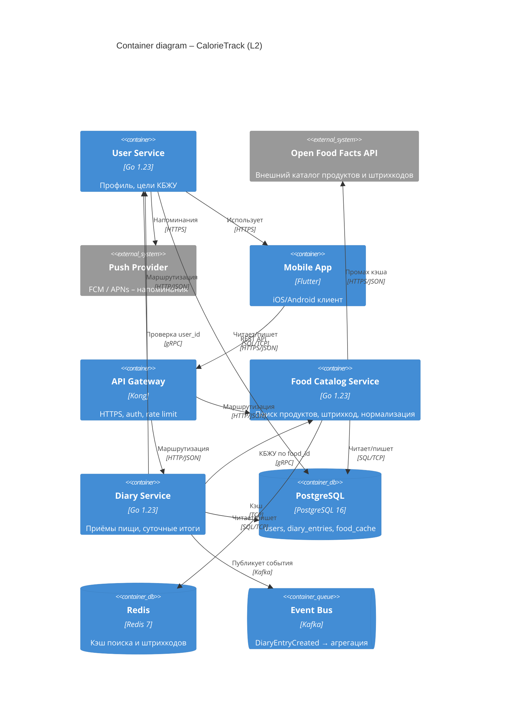
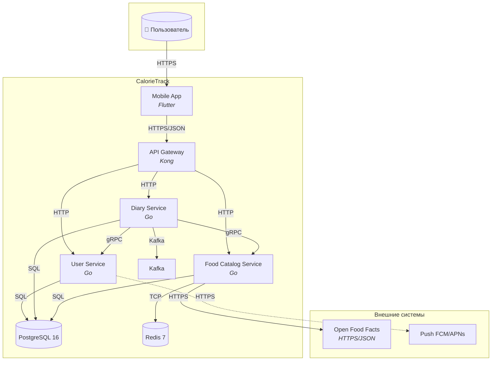

# Design Doc: платформа подсчёта калорий (CalorieTrack)

**Автор:** Ekaterina Zababurina  
**Статус:** Draft  
**Дата:** 2026-05-17  
**Версия:** 0.1  

> **Сноска.** Итоговый проект курса **опционален**; полную реализацию и защиту на занятиях **не планирую**. Этот документ – учебная основа по занятию 18 (docs-as-code, C4 L2) на кейсе **«сервис для подсчёта калорий»**. Артефакты по авиапоиску из ДЗ 2–17 остаются отдельной сквозной линией курса.

---

## Background

Пользователи ведут **дневник питания**: ищут продукты, добавляют приёмы пищи, сравнивают суточную норму калорий с целью (похудение / поддержание / набор).

**Текущая ситуация (as-is):**

- MVP – монолит: один backend + SQLite, поиск продуктов синхронно во внешнем API.
- **Проблемы:**
  - p95 `GET /foods/search` **~800 ms** при промахе кэша (внешний каталог).
  - При 3 репликах монолита – **разный in-process кэш** → разные КБЖУ для одного штрихкода.
  - Пики в **08:00–10:00** и **19:00–21:00** (завтрак/ужин): CPU **85%**, ошибки таймаута **~0.8%**.
  - Нет явного разделения «профиль пользователя» и «каталог продуктов» – сложно масштаировать команды.

**Целевая картина (to-be):** микросервисная платформа с общим API Gateway, кэшем каталога, event-driven обновлением дневной статистики.

**Ориентиры нагрузки (back-of-the-envelope):**

| Параметр | Значение |
|----------|----------|
| MAU | 30 000 |
| DAU | ~40% MAU → 12 000 |
| Записей еды / активный пользователь / день | ~5 |
| Пиковый RPS (API) | **~50 RPS** (с запасом ×3 к расчёту) |
| Хранение | ~3 года истории на пользователя |

---

## Goals

1. Снизить **p95 latency** поиска продуктов `GET /api/v1/foods/search` с **800 ms до ≤ 300 ms** при **50 RPS** (с distributed cache).
2. Достичь **cache hit rate ≥ 70%** для топ-запросов и штрихкодов при **3+** репликах catalog-service.
3. Обеспечить **availability 99.9%** для записи приёма пищи `POST /api/v1/diary/entries` (критичный путь пользователя).

---

## Non-Goals

- **Не** делаем ML-распознавание еды по фото (только ручной поиск / штрихкод в v1).
- **Не** интегрируем носимые устройства (Apple Health / Google Fit) – следующая итерация.
- **Не** выходим за РФ по хранению ПДн в v1 (ФЗ-152, один регион).
- **Не** строим социальную сеть / ленту – только личный дневник.

---

## Design

### C4 Level 2 – Container diagram



> Если Mermaid C4 не рендерится в вашем просмотрщике – см. эквивалент ниже (graph).



### Ключевые контейнеры

| Контейнер | Технология | Ответственность | Протоколы |
|-----------|------------|-----------------|-----------|
| **Mobile App** | Flutter | UI, офлайн-черновик записей | HTTPS → Gateway |
| **API Gateway** | Kong | Auth (JWT), rate limit, routing | HTTPS in, HTTP to services |
| **User Service** | Go | Профиль, цель калорий/БЖУ, вес | REST + gRPC internal |
| **Food Catalog Service** | Go | Поиск, штрихкод, кэш, fallback на OFF | REST, gRPC, Redis, HTTPS → OFF |
| **Diary Service** | Go | CRUD приёмов пищи, дневной итог | REST, gRPC к user/catalog, Kafka out |
| **PostgreSQL** | PG 16 | OLTP: users, entries, materialized foods | SQL |
| **Redis** | Redis 7 | Distributed cache catalog | RESP/TCP |
| **Kafka** | Kafka 3.x | `diary.entry.created` → аналитика/агрегаты | Kafka protocol |

### Основные потоки

1. **Поиск продукта:** App → Gateway → Catalog → (Redis hit | OFF API) → JSON с `kcal`, `protein`, `fat`, `carbs`.
2. **Запись приёма пищи:** App → Gateway → Diary → gRPC Catalog (snapshot КБЖУ) + gRPC User (проверка) → PG → Kafka event.
3. **Дневной итог:** App → Gateway → Diary → агрегат по `user_id` + `date` из PG (или read-model).

### Связь с артефактами курса (авиакейс)

| Тема курса | Аналог в CalorieTrack |
|------------|---------------------|
| Кэш ([hw/15](hw/15/)) | Redis + TTL 10 min для catalog |
| Async saga ([hw_14](hw_14_async_booking_payment.md)) | Kafka после записи дневника |
| SLO / алерты ([hw_11](hw_11_slo.md), [hw_12](hw_12_alerts_runbooks.md)) | error rate, p99 search, saturation |
| Feature flags / deploy ([hw_16](hw_16_ranking_rollout_plan.md)) | rollout нового scoring продуктов |
| Контракты ([hw/17](hw/17/)) | OpenAPI `api/openapi.yaml` в репозитории |

---

## Alternatives Considered

| Вариант | За | Против | Решение |
|---------|-----|--------|---------|
| **A. Монолит (status quo)** | Простота, один деплой | Не масштаирует catalog vs diary, общий релиз | **Отвергнут** |
| **B. Микросервисы + Kafka (выбрано)** | Независимый scale catalog, async аналитика | Ops-сложность, распределённые транзакции | **Принят** |
| **C. BFF + GraphQL единый backend** | Гибкий API для mobile | Overfetch/сложность схемы, один blast radius | **Отвергнут** для v1 |
| **In-process cache vs Redis** | 0 ms, нет Redis | Несогласованность между репликами | **Redis** ([аналог hw/15](hw/15/WRITEUP.md)) |
| **Своя БД продуктов vs только OFF** | Контроль данных | Дорогой контент, устаревание | **Гибрид:** PG materialized + OFF fallback |

---

## Risks

| Риск | Вероятность | Impact | Митигация |
|------|-------------|--------|-----------|
| Open Food Facts недоступен | Средняя | Поиск не работает | Circuit breaker + stale cache + локальный PG snapshot |
| Расхождение КБЖУ в дневнике и каталоге | Средняя | Неверный итог калорий | Snapshot нутриентов в `diary_entry` при записи |
| Hot key в Redis (популярные продукты) | Низкая | Latency spikes | Singleflight + TTL jitter |
| Утечка ПДн (вес, цели) | Низкая | Регуляторика | Шифрование at rest, доступ только через User Service |
| Сложность для малой команды | Средняя | Задержка релизов | Начать с 2 сервисов (catalog + diary), user – модуль внутри diary до split |

---

## Структура репозитория (docs-as-code)

```text
calorie-track/
├── README.md
├── docs/
│   ├── design/
│   │   └── calorie-platform.md      # этот документ (или ссылка)
│   ├── adr/
│   │   ├── 001-split-catalog-diary.md
│   │   └── 002-redis-cache.md
│   ├── architecture/
│   │   └── c4-containers.mmd        # исходник диаграммы
│   └── api/
│       └── openapi.yaml
├── .github/workflows/
│   └── docs-lint.yml                # markdown + spectral OpenAPI
└── services/
    ├── catalog/
    ├── diary/
    └── user/
```

**Жизненный цикл:** Draft → Review (PR) → Accepted → обновление при изменении архитектуры; дата и статус в шапке обязательны.

---

## Следующие шаги (вне scope сдачи ДЗ-18)

- [ ] C4 L1 System Context (для презентации бизнесу)
- [ ] NFR-таблица с расчётом RPS (как [hw_2](hw_2.md))
- [ ] ADR по выбору Kafka vs sync для агрегатов
- [ ] OpenAPI для `catalog` и `diary`

---

## Итог

Подготовлена **основа итогового проекта** на кейсе **CalorieTrack**: заполнены Background, Goals, Non-Goals, Design, Alternatives, Risks и **C4 Container (L2)** с **7 контейнерами**, технологиями и протоколами. Полная защита проекта не планируется – документ служит учебным артефактом занятия 18.
