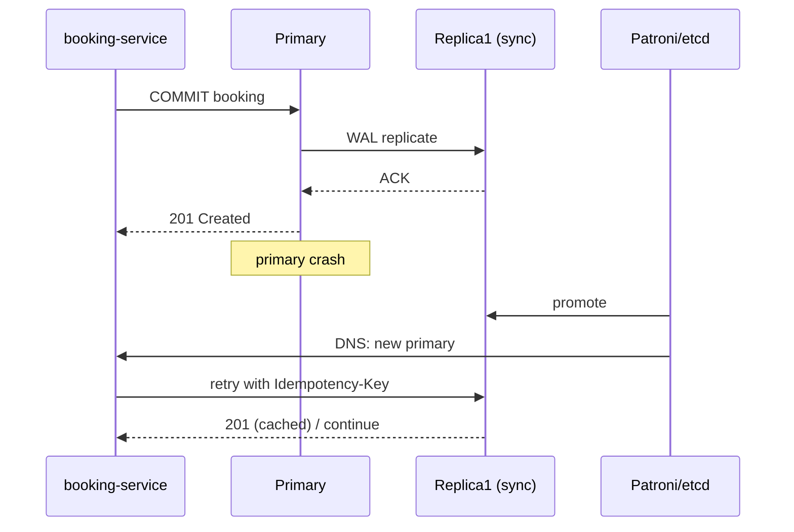

# ADR-008: Репликация и консистентность для сервиса бронирования

**Дата:** 2026-05-18  
**Статус:** Accepted  

---

## Контекст

Учебный сервис поиска и бронирования авиабилетов хранит:

- **критичные данные** – бронирования, платежи, инвентарь мест (OLTP, PostgreSQL);
- **некритичные read-модели** – кэш поиска, сессии, аналитика.

NFR (из ДЗ-2 и занятия 8):

| Параметр | Значение |
|----------|----------|
| Availability (бронирование) | 99.95% (~4.4 ч downtime/год) |
| RPO (бронирования) | **0** |
| RPO (аналитика) | 5 мин |
| RTO (бронирование) | **< 30 с** |
| Read : Write | **8 : 1** (поиск доминирует) |
| Peak write RPS | 50 (бронирование + оплата) |
| Peak read RPS | 400 (поиск, каталог) |
| Регуляторика | ФЗ-152 – данные в РФ, один primary-регион |

**Вопрос:** какую топологию репликации выбрать, какие **N, W, R** задать для ключевых операций и что происходит при отказах узлов.

> **Важно:** формула **W + R > N** – модель **leaderless**-хранилищ (Dynamo, Cassandra).  
> Для **PostgreSQL primary-replica** эквивалент durability даёт **semi-sync** (`synchronous_standby_names = 'FIRST 1'`).  
> Ниже W/R/N приведены **и как логическая модель кворума**, и как маппинг на PG – это ожидаемо в задании курса.

---

## Решение: топология репликации

### Выбранная схема

**Single-primary + 2 реплики** в одном регионе (3 AZ при возможности), **semi-synchronous** репликация для записей бронирований.

```text
                    ┌─────────────────────────────────────┐
                    │         booking-service (stateless) │
                    │  write → primary  read → replica*   │
                    └──────────────┬──────────────────────┘
                                   │
         ┌─────────────────────────┼─────────────────────────┐
         │                         │                         │
         ▼                         ▼                         ▼
  ┌─────────────┐          ┌─────────────┐          ┌─────────────┐
  │  Primary    │── WAL ──►│  Replica 1  │          │  Replica 2  │
  │  (sync)     │── WAL ──►│  (sync cand)│◄─ async ─│  (read)     │
  │  AZ-a       │          │  AZ-b       │          │  AZ-c       │
  └─────────────┘          └─────────────┘          └─────────────┘
         │                         │
         │    Patroni + etcd (failover, fencing)      │
         └─────────────────────────┘

  * read: replica с lag < 5s; после POST /bookings – primary (read-your-writes)

  ┌──────────────┐     async CDC/WAL      ┌──────────────┐
  │ Redis Cluster│◄──────────────────────│ flight_cache │
  │  (поиск)     │                       │  (materialized)│
  └──────────────┘                       └──────────────┘

  ┌──────────────┐     async insert       ┌──────────────┐
  │ Analytics DB │◄──────────────────────│ outbox/events│
  │ (отдельный PG)│                      └──────────────┘
  └──────────────┘
```

### Почему не multi-primary и не leaderless

| Вариант | Плюсы | Минусы | Вердикт |
|---------|-------|--------|---------|
| **Single-primary + replicas** | ACID, `SELECT FOR UPDATE`, знакомый стек, Patroni | Write bottleneck на primary | **Выбран** для OLTP бронирований |
| Multi-primary (Galera) | Нет SPOF на запись | Конфликты concurrent write, сложнее ops | Отвергнут для core bookings |
| Leaderless + W/R/N (Cassandra) | Tunable quorum, горизонтальный scale | Нет полноценных транзакций между сущностями, сложнее «одно место – один пассажир» | Отвергнут как primary store; допустим для счётчиков/кэша |

**Обоснование:** бронирование требует **linearizability** на инвентаре мест и платежах. PostgreSQL + semi-sync даёт **RPO = 0** при отказе одной реплики и **RTO ~15–30 с** с Patroni – укладывается в NFR без изобретения собственного кворума на application layer.

### Параметры PostgreSQL (production)

```ini
# primary
wal_level = replica
max_wal_senders = 5
synchronous_standby_names = 'FIRST 1 (replica1, replica2)'
synchronous_commit = on

# replica (hot standby)
hot_standby = on
```

**Semi-sync:** primary ждёт ACK **одной** из реплик → данные минимум на **2 из 3** узлах до ответа клиенту. Вторая реплика – async, разгружает чтение.

---

## Шаг 1. Таблица компонентов: тип репликации и N/W/R

| Компонент | Топология | N | W | R | Тип репликации | Обоснование |
|-----------|-----------|---|---|---|----------------|-------------|
| **Bookings DB** (PostgreSQL) | Primary + 2 replica | 3 | 2 | 2 | Semi-sync (write), streaming (read) | RPO=0: запись подтверждается primary + 1 replica; W+R=4>3 – пересечение для strong read; переживаем отказ 1 узла |
| **Flight cache** (Redis Cluster) | 3 master + 3 replica | 6 | 1 | 1 | Async replication | Поиск: eventual OK, lag 1–5 с; максимальная скорость; потеря последних секунд кэша допустима |
| **Analytics DB** (PostgreSQL) | Primary + 1 async replica | 2 | 1 | 1 | Async | RPO ≤ 5 мин по NFR; не блокирует booking path |
| **Session store** (Redis) | Sentinel, 3 nodes | 3 | 2 | 1 | Semi-sync (WAIT) | Потеря сессии – re-login, не финансы; quorum write для durability |

### W/R/N для трёх операций (логическая модель)

| Операция | Хранилище | N | W | R | W+R>N? | Consistency | PACELC (норма / partition) |
|----------|-----------|---|---|---|--------|-------------|----------------------------|
| **POST /bookings** (создание) | Bookings PG | 3 | **2** | – | – (write-only quorum) | Linearizability (`SERIALIZABLE` + `FOR UPDATE` на primary) | **PC/EC** – жертвуем latency (+2–5 ms RTT до sync replica) |
| **GET /bookings** (мои брони) | Bookings PG | 3 | – | **2** или primary | 4 > 3 при R=2 | Read-your-writes: после create – **primary** 5 с; иначе replica с lag < 5 s | **PC/EC** при strong read; **PA/EL** если читаем async replica без токена |
| **GET /search** (поиск рейсов) | Redis + PG cache | 3* | **1** | **1** | 2 < 3 → eventual | Eventual – цены/места с задержкой 5–30 с OK | **PA/EL** – availability и latency важнее свежести |

\* для Redis-кластера N=3 шарда master; для упрощения схемы в задании.

#### Почему именно W=2, R=2 для бронирований (N=3)

- **Запись W=2:** подтверждение от primary + одной реплики → при падении primary данные уже на replica (failover без потери committed транзакций).
- **Чтение R=2:** при leaderless-интерпретации гарантирует пересечение с последней записью; в PG эквивалент – чтение с **primary** или replica с `replay_lag < порога`.
- **Допустимый отказ:** 1 узел из 3 (N − W = 1, N − R = 1).
- **Альтернатива W=3, R=1** отвергнута: каждая запись ждёт все реплики → write latency +availability риск при любом lagging replica.

#### Почему W=1, R=1 для поиска

- Read-heavy (400 vs 50 RPS), stale цены на 10–30 с не ломают UX.
- **W+R=2 не больше N** → **нет strong consistency** – осознанный trade-off по PACELC (latency).

---

## Шаг 2. Поведение при отказах (Bookings DB, N=3, W=2, R=2)

| Сценарий отказа | Доступно узлов | Запись работает? | Чтение работает? | RPO | RTO | Поведение |
|-----------------|----------------|------------------|------------------|-----|-----|-----------|
| Все узлы работают | 3 | Да | Да (replica / primary) | 0 | – | Штатный режим |
| Отказ **1 реплики** | 2 | **Да** (2 ≥ W) | **Да** (2 ≥ R или primary) | 0 | – | Patroni исключает узел; оставшаяся sync-replica принимает WAL; алерт на degraded redundancy |
| Отказ **primary** (failover) | 2 | **Пауза 15–30 с**, затем да | Да (новый primary) | 0* | **15–30 с** | Patroni promote sync-replica; приложение reconnect по DNS; in-flight транзакции – retry с Idempotency-Key |
| Отказ **primary + 1 replica** | 1 | **Нет** (1 < W) | **Нет** (1 < R) | – | до восстановления узла | Кластер read-only / 503 на write; **split-brain исключён** – minority не promote (etcd quorum) |
| **Split-brain** (partition 1 \| 2) | 1 \| 2 | Нет на стороне **1** | Нет на стороне **1** | 0 на majority | – | Majority (2 узла) продолжает работу; minority отклоняет запросы (fencing / Patroni). После heal – resync replica |

\* при semi-sync: committed = на primary + ack replica до crash.

### Диаграмма: failover primary



### Мониторинг (обязательно для RPO/RTO)

| Метрика | Warning | Critical |
|---------|---------|----------|
| `replication_lag_seconds` | > 5 s | > 30 s |
| `sync_standby_count` | < 1 | 0 |
| `patroni_cluster_unlocked` | – | false > 60 s |

---

## Шаг 3. Идемпотентность POST /bookings

Retry (занятие 7) + сеть без ACK → риск **двойного бронирования**. Решение: **Idempotency-Key** (UUID от клиента).

### Алгоритм

```text
1. Клиент: POST /bookings + Header Idempotency-Key: <uuid>
2. Сервер BEGIN:
     INSERT idempotency_keys (key, status='processing') ON CONFLICT → read cached response → COMMIT → return
     INSERT booking ... (business logic)
     UPDATE idempotency_keys SET status='completed', response=...
   COMMIT
3. Повтор с тем же ключом → тот же booking_id, без второй записи
```

| Параметр | Значение |
|----------|----------|
| Хранилище | PostgreSQL (та же БД, одна транзакция с booking) |
| TTL ключа | 24 ч |
| Уникальность | `UNIQUE (idempotency_key)` на `bookings` или отдельная таблица |

**Почему не Redis-only:** race «ключ записан, booking нет» при crash между двумя store.

---

## Шаг 4. Consistency model по операциям (PACELC)

| Операция | Модель | При partition (P) | В норме (E) | Обоснование |
|----------|--------|-------------------|-------------|-------------|
| Создание бронирования | Linearizability | **CP** – отказ, если нет quorum | **EC** – ждём sync replica | Два клиента не должны занять одно место |
| Оплата | Linearizability | CP | EC | Финансы, RPO=0 |
| Поиск рейсов | Eventual | **AP** – stale данные лучше 503 | **EL** – быстрый ответ с replica/cache | Задержка цен 5–30 с допустима (ДЗ-2) |
| Мои бронирования | Read-your-writes | CP на write path | EL на read с primary после write | Пустой список после 201 – недопустимый UX |
| Аналитика | Eventual | AP | EL | RPO 5 мин |

**Антипаттерн:** linearizability на поиске – перегруз primary, падение throughput в 5–10× без выгоды.

---

## Рассмотренные альтернативы (кратко)

| Альтернатива | Почему отвергнута |
|--------------|-------------------|
| Async-only репликация | RPO > 0 при failover – нарушает NFR на бронирования |
| 3 sync replicas (W=3) | Лишняя write latency; отказ любой реплики блокирует запись |
| Multi-primary | Конфликты на одном `seat_id`; сложный conflict resolution |
| Cassandra W=2,R=2 для bookings | Нет привычных cross-row ACID; избыточно при текущем RPS (50 write) |

---

## Матрица решений

Оценка 1–5, вес × оценка.

| Критерий | Вес | Async replica | Full sync (W=3) | Semi-sync + 2 replica |
|----------|----:|--------------:|----------------:|----------------------:|
| RPO=0 для bookings | 3 | 2 → 6 | 5 → 15 | 5 → 15 |
| RTO < 30 s | 2 | 4 → 8 | 3 → 6 | 5 → 10 |
| Read scaling (8:1) | 2 | 5 → 10 | 4 → 8 | 5 → 10 |
| Операционная простота | 1 | 5 → 5 | 3 → 3 | 4 → 4 |
| Write latency | 1 | 5 → 5 | 2 → 2 | 4 → 4 |
| **Итого** | **9** | **34** | **34** | **43** |

Победитель: **semi-sync, N=3, W=2, R=2** (с read-your-writes на application layer).

---

## Последствия

### Позитивные

- RPO=0 для committed бронирований при отказе одного узла.
- Read-масштабирование: до ~3× на чтение через 2 реплики.
- Предсказуемое поведение при отказах – задокументировано для design review.
- Idempotency-Key + retry = exactly-once semantics для клиента.

### Негативные

- Write latency +2–5 ms (RTT до sync replica в одном регионе).
- При потере 2 из 3 узлов – write недоступен (CP).
- Replication lag → риск stale read без session stickiness / LSN token.
- Репликация **не заменяет** backup: `DELETE` без WHERE реплицируется на все узлы → нужны PITR + delayed replica (1 ч).

### Риски и митигации

| Риск | Митигация |
|------|-----------|
| Split-brain | Patroni + etcd, fencing, `maximum_lag_on_failover` |
| Потеря данных при async failover | Semi-sync; алерт `sync_standby < 1` |
| Двойное бронирование | Idempotency-Key + `SELECT FOR UPDATE` |
| Human error (DROP TABLE) | PITR, delayed replica, ежедневный `pg_dump` |

---

## Итог

Для учебного сервиса бронирования выбрана топология **single-primary + 2 реплики (semi-sync)** в одном регионе.

- **Бронирования:** N=3, **W=2**, **R=2** (логически), фактически – `synchronous_standby_names = 'FIRST 1'`, strong read с primary / low-lag replica, **read-your-writes** после create.
- **Поиск:** N=3, **W=1**, **R=1**, eventual consistency на Redis/cache.
- При отказе **1 узла** – запись и чтение работают; при отказе **2 узлов** – CP, сервис недоступен для mutate; failover primary – **RTO 15–30 с**, **RPO 0** для committed данных.

Дополнительно: **Idempotency-Key** на `POST /bookings`, мониторинг `replay_lag`, PITR как защита от логических ошибок.
