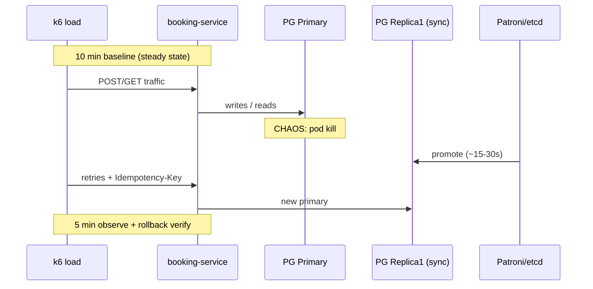

# Chaos Experiment: отказ PostgreSQL primary при пиковой нагрузке

**Сервис:** учебный сервис поиска и бронирования (ADR-008, ДЗ-8)  
**Среда:** staging (обязательно); production – только после 2 успешных прогонов в staging  
**Владелец эксперимента:** Platform / SRE + команда booking-service  
**Blast radius:** 1 узел PostgreSQL (primary pod / VM), 1 AZ не затрагивается целиком

---

## 1. Цель эксперимента

Проверить, что архитектура **primary + 2 replica (semi-sync, Patroni)** из ДЗ-8 выдерживает внезапную потерю primary без потери committed бронирований (**RPO = 0**) и с восстановлением write path за **RTO < 30 с**, при этом read path и идемпотентность не создают дубликатов.

Связь с занятиями 6–8:

| Спроектировано (ДЗ-8) | Что проверяем chaos-экспериментом |
|----------------------|-----------------------------------|
| Semi-sync, W=2 | Committed транзакции переживают kill primary |
| Patroni failover | RTO укладывается в NFR |
| Read-your-writes | После failover `GET /bookings` не пустой |
| Idempotency-Key | Retry после failover не создаёт вторую бронь |
| Circuit breaker (ДЗ-7) | Поиск деградирует, но не валит booking path |

---

## 2. Гипотеза

> **Если** в staging при steady-state нагрузке (50 write RPS, 400 read RPS) мы принудительно остановим **только** PostgreSQL primary,  
> **то** в течение **30 с** Patroni promote sync-replica в новый primary,  
> **и** при этом:
>
> - **error rate** API бронирования (`POST /bookings`, `GET /bookings`) не превысит **0.5%** за окно инъекции (5 мин);
> - **p99 latency** `POST /bookings` не превысит **5 с** (включая паузу failover + retry клиента);
> - **committed** бронирования до kill primary **не потеряются** (сверка count + idempotency);
> - **duplicate bookings** при retry с тем же `Idempotency-Key` **= 0**;
> - **replication_lag** на новом primary после promote стабилизируется **< 5 с** в течение 2 мин;
> - поиск (`GET /search`) может деградировать (stale cache), но **error rate < 1%** (graceful degradation).

**Альтернативная гипотеза (отклоняем до основного прогона):** «система упадёт полностью» – слишком грубо; не измеряет RTO/RPO.

---

## 3. Steady State (нормальное поведение)

Измеряем **baseline 10 минут** до инъекции при фоновой нагрузке k6. Все пороги – относительно baseline, если не указано абсолютное значение.

| Метрика | Источник | Steady State (целевое) | Порог отклонения при chaos |
|---------|----------|------------------------|----------------------------|
| `http_requests_total{path="/bookings",status=~"5.."}` rate | Prometheus | < **0.05%** от всех `POST+GET /bookings` | **FAIL** если > **0.5%** > 2 мин подряд |
| `http_request_duration_seconds{path="/bookings"}` p99 | Prometheus | < **800 ms** (staging) | **FAIL** если > **5 s** > 1 мин |
| `http_requests_total{path="/search"}` error rate | Prometheus | < **0.1%** | **WARN** если > **1%**; **FAIL** если > **5%** |
| `pg_stat_replication_replay_lag` | postgres_exporter | < **1 s** | **WARN** > **5 s**; **FAIL** > **30 s** > 3 мин |
| `patroni_sync_standby_count` | Patroni metrics | **≥ 1** | **FAIL** если **0** > 60 s (нет RPO=0) |
| `booking_created_total` (counter) | app metrics | монотонный рост | сверка с БД после эксперимента |
| Successful `POST /bookings` с retry | k6 + logs | 201, один `booking_id` на key | **FAIL** если 2+ booking на один Idempotency-Key |

**Нагрузка steady state (k6, 10 мин baseline):**

```javascript
// Упрощённый профиль (staging)
export const options = {
  scenarios: {
    search:  { executor: 'constant-arrival-rate', rate: 400, timeUnit: '1s', duration: '10m', preAllocatedVUs: 50 },
    booking: { executor: 'constant-arrival-rate', rate: 50,  timeUnit: '1s', duration: '10m', preAllocatedVUs: 20 },
  },
};
```

**Инварианты (должны выполняться всегда):**

- Запись идёт только на **primary** (нет write на replica).
- После `POST /bookings` в течение 5 с `GET /bookings` маршрутизируется на **primary** (read-your-writes).

---

## 4. Метод инъекции отказа

### 4.1. Выбранный метод

| Параметр | Значение |
|----------|----------|
| **Тип отказа** | Kill process / pod (имитация crash primary, не graceful shutdown) |
| **Цель** | Pod `postgres-primary-0` (StatefulSet `bookings-pg`, label `role=primary`) |
| **Инструмент** | **Litmus Chaos** `pod-delete` (staging K8s) **или** `kubectl delete pod` + Patroni |
| **Длительность** | Primary недоступен до завершения failover (~15–30 с); наблюдение **5 мин** после promote |
| **Повтор** | 1 kill в прогон; повторный kill – отдельный эксперимент |

**Почему Litmus, а не Toxiproxy:** нужен отказ **узла БД**, а не сетевой задержки. Toxiproxy – для эксперимента №2 (replication lag / partition).

**Почему не Chaos Gorilla (вся AZ):** blast radius слишком велик для первого прогона; нарушает принцип минимального воздействия.

### 4.2. Litmus ChaosEngine (фрагмент)

```yaml
apiVersion: litmuschaos.io/v1alpha1
kind: ChaosEngine
metadata:
  name: postgres-primary-kill
  namespace: staging-booking
spec:
  appinfo:
    appns: staging-booking
    applabel: "app=bookings-pg,role=primary"
    appkind: statefulset
  chaosServiceAccount: litmus-admin
  experiments:
    - name: pod-delete
      spec:
        components:
          env:
            - name: TOTAL_CHAOS_DURATION
              value: "60"
            - name: FORCE
              value: "true"
            - name: PODS_AFFECTED_PERC
              value: "100"
```

### 4.3. Ручной fallback (если Litmus недоступен)

```bash
# Только staging, согласование в #incident-drill
kubectl -n staging-booking delete pod bookings-pg-0 --force --grace-period=0
```

### 4.4. Схема эксперимента



---

## 5. Метрики для наблюдения

### 5.1. Dashboard (Grafana)

Панели на одном дашборде «Chaos – PG Primary Kill»:

1. **Golden signals API:** RPS, error rate, p50/p99 latency по `path` (`/bookings`, `/search`, `/healthz`).
2. **PostgreSQL:** `replay_lag`, `sync_standby_count`, `patroni_role`, `patroni_pending_failover`.
3. **Приложение:** `idempotency_cache_hits`, `db_pool_primary_connections`, `db_pool_replica_connections`.
4. **Бизнес:** `bookings_created_total`, расхождение counter vs `SELECT count(*)`.

### 5.2. Логи и трейсы

- `slog` / JSON: `trace_id`, `Idempotency-Key`, ошибки `connection refused`, `read-only transaction`.
- Jaeger: цепочка `POST /bookings` → DB → ответ 201 или retry.

### 5.3. Синтетические пробы

| Проба | Интервал | Назначение |
|-------|----------|------------|
| `GET /healthz` | 10 s | Живость API |
| `POST /bookings` (canary + test key) | 30 s | Write path после failover |
| `GET /bookings` после canary write | 30 s | Read-your-writes |

---

## 6. Критерии успеха и провала

### 6.1. Успех (эксперимент пройден)

| # | Критерий | Измерение |
|---|----------|-----------|
| S1 | Failover завершён | `patroni_role=master` на бывшей replica ≤ **30 s** от kill |
| S2 | RPO = 0 | Все booking_id, созданные за 1 мин **до** kill и получившие **201**, есть в БД после эксперимента |
| S3 | Нет дублей | 0 пар записей с одним `idempotency_key` и разными `booking_id` |
| S4 | Error rate bookings | < **0.5%** за 5 мин окна chaos |
| S5 | p99 POST /bookings | < **5 s** (включая failover window) |
| S6 | Read-your-writes | Canary: `GET /bookings` в течение 5 s после write возвращает созданную бронь |
| S7 | Rollback выполнен | Кластер в исходной топологии, lag < 5 s, алерты зелёные |

### 6.2. Провал (эксперимент не пройден)

| # | Условие | Действие |
|---|---------|----------|
| F1 | Потеря ≥ 1 committed booking | **STOP**, incident, отключить chaos, восстановление из PITR |
| F2 | RTO > **60 s** или split-brain (2 primary) | STOP, ручной failover runbook |
| F3 | Error rate bookings > **1%** > 3 мин | STOP, анализ CB/pool/timeouts |
| F4 | Дубликат бронирования по Idempotency-Key | STOP, баг в идемпотентности |
| F5 | `sync_standby_count = 0` > 2 мин после стабилизации | FAIL по durability; не идти в prod |

### 6.3. Допустимая деградация (не провал)

- Рост p99 поиска до **2×** baseline.
- Кратковсплеск 503 на `POST /bookings` **< 30 s** (failover window).
- Переключение read на primary (рост load на primary) – ожидаемо.

---

## 7. Rollback plan

### 7.1. Автоматический rollback (во время эксперимента)

| Триггер | Действие |
|---------|----------|
| Litmus `TOTAL_CHAOS_DURATION` истёк | Эксперимент завершён; pod пересоздаётся K8s |
| Patroni failover успешен | Старый primary pod при старте станет replica (rewind) |
| **Safety:** error rate > **2%** 2 мин | Оператор нажимает **Litmus abort** / `kubectl delete chaosengine` |

### 7.2. Ручной rollback (пошагово)

```text
1. Немедленно: abort chaos
   kubectl delete chaosengine postgres-primary-kill -n staging-booking

2. Проверить Patroni:
   patronictl list   # ровно 1 Leader, 2 Replica, все running

3. Если split-brain / 2 Leader:
   - включить maintenance mode на API (feature flag)
   - выполнить runbook «Patroni manual reconcile» (fencing старого primary)
   - НЕ продолжать нагрузку до 1 Leader

4. Восстановить топологию (если старый primary не вошёл в кластер):
   patronictl reinit bookings-pg-0 --force
   # или восстановление из base backup + WAL

5. Проверить приложение:
   - drain connection pools (rolling restart booking-service)
   - DNS/service discovery указывает на текущий Leader

6. Верификация (15 мин):
   - replay_lag < 5s на всех replica
   - sync_standby_count >= 1
   - k6 smoke: 10 POST /bookings + GET с Idempotency-Key

7. Post-mortem в течение 48 ч (даже при успехе)
```

### 7.3. Откат нагрузки

```bash
# Остановить k6
pkill -f "k6 run"   # или остановить CI job

# Снять флаги maintenance
kubectl set env deployment/booking-service MAINTENANCE_MODE=false -n staging-booking
```

### 7.4. Критерий завершения rollback

- Steady state метрики в пределах baseline ±10% в течение **10 мин**.
- Нет активных P1/P2 алертов по БД и API.
- Зафиксирован протокол: timestamps kill → promote → first successful write.

---

## 8. Runbook выполнения (хронология)

| Время | Шаг | Ответственный |
|-------|-----|----------------|
| T−24 h | Ревью плана, freeze деплоев staging | Tech lead |
| T−1 h | Snapshot БД + проверка backup/PITR | DBA |
| T−30 min | Запуск k6 baseline, открыть Grafana dashboard | QA / SRE |
| T−10 min | Verify steady state (все пороги OK) | SRE |
| T−5 min | Уведомление в Slack `#chaos-drills` | Ведущий |
| **T0** | Инъекция: kill primary | SRE |
| T0–T+30 s | Наблюдение failover, не abort без F1–F5 | Все |
| T+30 s – T+5 min | Наблюдение под нагрузкой | SRE |
| T+5 min | Stop k6, abort chaos если ещё active | SRE |
| T+10 min | Rollback verify, сверка RPO/идемпотентность | DBA + Dev |
| T+24 h | Post-mortem / action items | Ведущий |

**Участники:** SRE (ведущий), DBA, 2 backend, 1 QA.  
**Стоп-кран:** слово «ABORT» в звонке → любой участник останавливает эксперимент.

---

## 9. Рассмотренные альтернативы инъекции

| Эксперимент | Инъекция | Почему не первый прогон |
|-------------|----------|-------------------------|
| **Primary kill** (выбран) | pod-delete | Прямая проверка RTO/RPO из ДЗ-8 |
| Replica kill | pod-delete replica-2 | Меньший риск; пройти **до** primary kill |
| Replication lag | Toxiproxy latency 30s на WAL | Проверка read-your-writes, не failover |
| Network partition | Litmus network-chaos | Split-brain риск; только после успешного #1 |
| Sync replica down | stop replica1 | Проверка `sync_standby_count=0` → write block |

**Рекомендуемая программа (квартал):** replica kill → primary kill → toxiproxy lag → partition (staging only).

---

## 10. Action items после эксперимента (шаблон)

| P | Действие | Владелец | Срок |
|---|----------|----------|------|
| P1 | Автоматизировать сверку RPO (скрипт count до/после) | Backend | +2 нед |
| P2 | Добавить алерт `patroni_no_leader` + runbook в wiki | SRE | +1 нед |
| P3 | Integration test: kill primary в Testcontainers + Patroni | Backend | +3 нед |
| P4 | Повторить эксперимент в prod-like staging с 2× RPS | SRE | +1 месяц |

---

## 11. Связанные документы

- [hw_8_replication-adr.md](hw_8_replication-adr.md) – топология, W/R/N, поведение при отказах
- [hw/7/hw_7_circuit-breaker-adr.md](hw/7/hw_7_circuit-breaker-adr.md) – circuit breaker на upstream поиска
- Principles of Chaos Engineering: https://principlesofchaos.org

---

## Итог

План проверяет ключевое предположение ДЗ-8: **потеря primary не приводит к потере данных и восстанавливается за < 30 с**, при активных retry и Idempotency-Key. Эксперимент структурирован по методологии Netflix (steady state → гипотеза → инъекция → наблюдение → rollback), blast radius минимален (1 pod), среда – staging до подтверждения всех критериев S1–S7.
